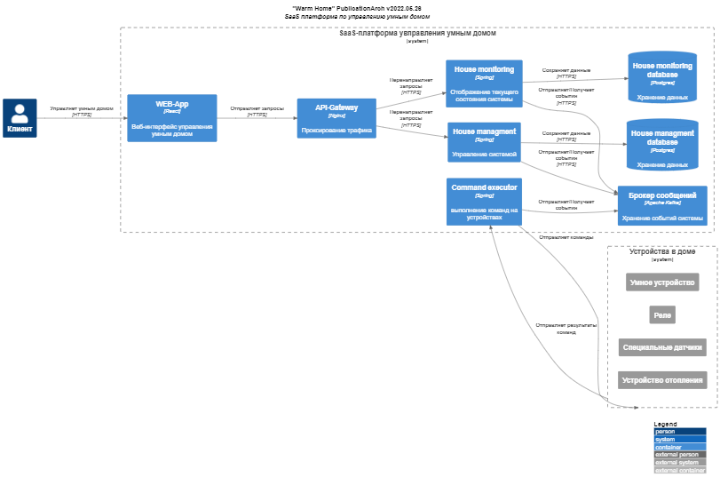
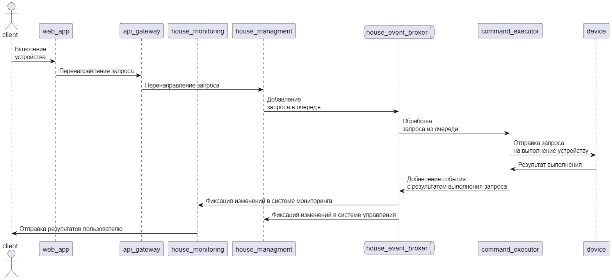
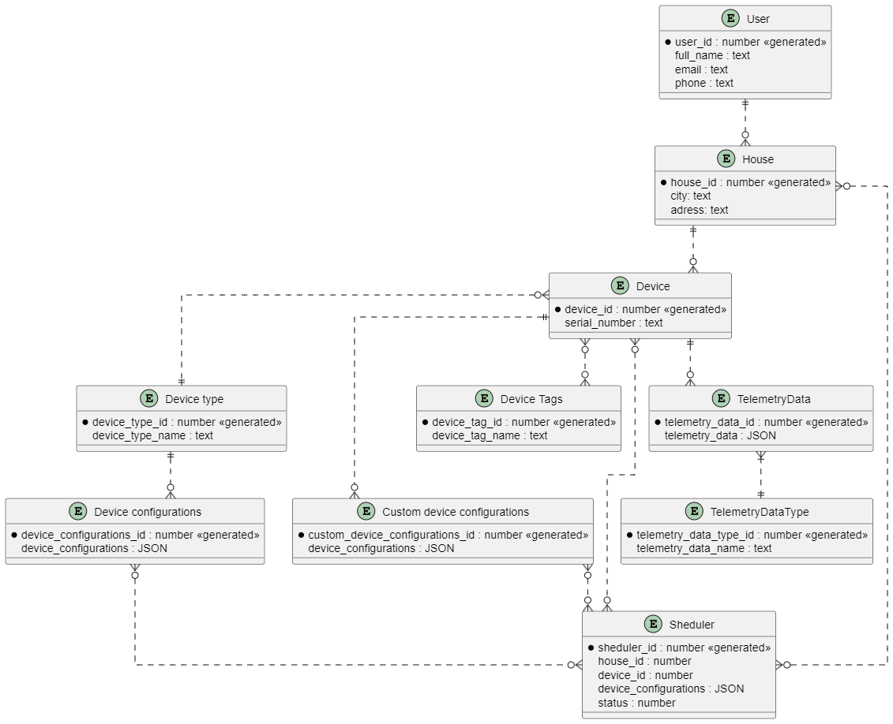

# Project_template

# Задание 1. Анализ и планирование

### 1. Описание функциональности монолитного приложения

**Управление отоплением:**

- Пользователи могут
    - Включать/Выключать отопление в доме.
- Система поддерживает
    - Отправку команды на устройство

**Мониторинг температуры:**

- Пользователи могут
    - Пользователи могут просматривать текущую температуру в своих домах через веб-интерфейс.
- Система поддерживает
    - Получение данных прямым запросом на устройство

### 2. Анализ архитектуры монолитного приложения

* **Язык программирования:** Java
* **База данных:** PostgreSQL
* **Архитектура:** Монолитная, все компоненты системы (обработка запросов, бизнес-логика, работа с данными) находятся в рамках одного приложения.
* **Взаимодействие:** Синхронное, запросы обрабатываются последовательно.
* **Масштабируемость:** Ограничена, так как монолит сложно масштабировать по частям.
* **Развёртывание:** Требует остановки всего приложения.

### 3. Определение доменов и границы контекстов

* [System] Тёплый дом
    * [Domain] Управление домом
        * [SubDomain] Управление отоплением
            * [Context] Включение отопления
                * Устройство
                * Api
                * Время включения
            * [Context] Выключение отопления
                * Устройство
                * Api
                * Время выключения
    * [Domain] Мониторинг дома
        * [SubDomain] мониторинг отопления
            * [Context] Сбор данных
                * Дом
                * Датчик
                * Значения датчика
                * Статус датчика
                * Api
            * [Context] Просмотр данных
                * Дом
                * Датчик
                * Значения датчика
                * Статус датчика
                * Api
                * Веб-интерфейс

### **4. Проблемы монолитного решения**

* Высокий риск ошибок
* Длительные циклы разработки и развёртывания
* Трудно управлять командой
* Трудно масштабировать отдельные компоненты системы
* Отсутствие гибкоси в выборе технологий разработки

### 5. Визуализация контекста системы — диаграмма С4

[Context-diagram (google disk)](https://drive.google.com/file/d/1cIDC-nXEQKm27Rluje0P1ycG6we-COeC/view?usp=sharing)

# Задание 2. Проектирование микросервисной архитектуры

**Диаграмма контейнеров (Containers)**

**Диаграмма компонентов (Components)**

**Диаграмма кода (Code)**

# Задание 3. Разработка ER-диаграммы

# ❌ Задание 4. Создание и документирование API